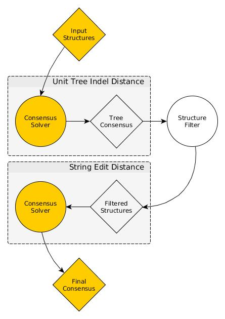

# MC-Cons


## Description

MC-Cons computes a structural assignment, that is, it assigns to each sequence
the structure that maximizes the overall sum of pair-wise structural
similarities.


It does so by first finding a tree structural assignment based on a simple
tree representation.
RNA base pairs are represented as nodes and a tree edit distance is used
(insertion cost = 1, deletion cost = 1, substitution = 0).

Once a tree consensus (or many) is found, the structures are filtered and a
consensus based on strings edit distance on the Vienna dot-bracket is used.
The simple string edit distance is used because it does work quite well.





There are currently two versions of the consensus optimizer available,
one using an exact solver with Branch and Bound strategy and an heuristic
one using an Hybrid Genetic Algorithm. Each version has an option to return
suboptimal consensus solutions along the optimal one(s).


A shape explorer tool is given to filter suboptimal consensus solutions by
keeping only the best consensus for each arrangement of abstract shapes.


## Requirements

- C++ compiler
- make
- vanilla python 2 interpreter (no package dependencies)


## Build Instructions

Using the provided makefile, just use the following (seems to work fine
on Linux and OSX).

```bash
make all
```


## Input Files

Input files must be of the following fasta-like format.
That is it should look like this (here suboptimal\_i\_j
refers to the jth suboptimal structure of the ith molecule).

All suboptimal structures must be represented in Vienna dot bracket notation.

    >name_0
    sequence_0
    suboptimal_0_0
    suboptimal_0_1
    ...
    suboptimal_0_n
    >name_1
    sequence_1
    suboptimal_1_0
    suboptimal_1_1
    ...
    suboptimal_1_m
    >name_
    ...


## Output Format

Consensus are outputted in the following fasta-like format to standard
output (suboptimal\_n\_l would be the chosen suboptimal at index l of
the nth molecule).

The tree score and string edit score are the average
distance between all selected structures.

    > solution_index tree_score string_edit_score
    suboptimal_0_i
    suboptimal_1_j
    suboptimal_2_k
    ...
    suboptimal_n_l
    > solution_index tree_score string_edit_score
    ...


## Usage Examples

```bash
# first, compile the C++ code
# (supposes g++ and make installed)
make all


# MC-CONS USAGE

# exact version (by branch and bound)
# use only on very small instances
bin/mccons_exact -f examples/mccons_example.marna

# exact version with suboptimal consensus
# here, all consensus within an average 0.5 unit tree distance
# more than the best consensus will be kept
bin/mccons_exact -f examples/mccons_example.marna -t 0.5

# heuristic version (an hybrid genetic algorithm, with steepest descent)
# defaults parameters behave fine on most small and medium instances
# population size and number of generations should be increased for large instances
bin/mccons_ga -f examples/mccons_example.marna

# same suboptimal threshold consideration as for the exact solver
bin/mccons_ga -f examples/mccons_example.marna -t 0.5


# SHAPE EXPLORER USAGE

# when considering suboptimal consensus, MC-Cons often returns too
# many consensus to be useful. This performs a selection of those
# with best scores for each arrangement of RNA abstract shapes (level 1, 3 or 5)
src/shape_explorer.py -i examples/shape_explorer_example.marna -l 5 -s

```


## To Do
- [ ] pretty print the consensus
- [ ] tRNA y-shaped consensus (waiting for the sequences)
- [ ] RNAse P alignment http://www.mbio.ncsu.edu/rnasep/seqs&structures.html
