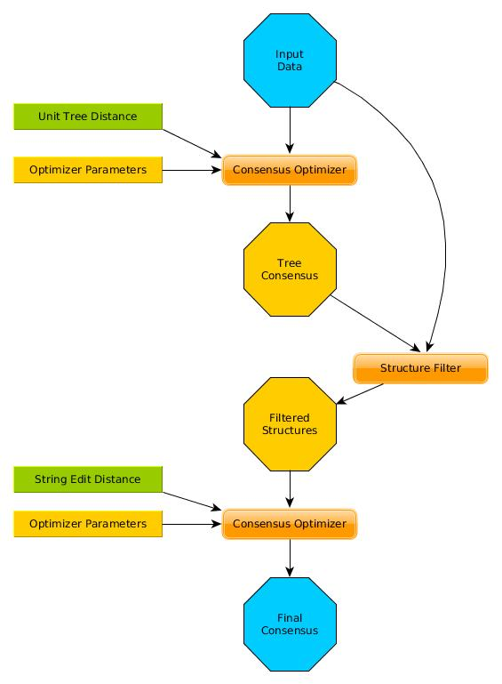

# MC-Cons


## Description

MC-Cons computes a structural assignment, that is, it assigns to each sequence
the structure that maximizes the overall sum of pair-wise structural
similarities.


It does so by first finding a tree structural assignment based on a simple
tree representation.
RNA base pairs are represented as nodes and a tree edit distance is used
(insertion cost = 1, deletion cost = 1, substitution = 0).

Once a tree consensus (or many) is found, the structures are filtered and a
consensus based on strings edit distance on the Vienna dot-bracket is used.
The simple string edit distance is used because it does work quite well.





There are currently two versions of the consensus optimizer available,
one using an hybrid Genetic Algorithm and the other one a Monte Carlo
coupled with steepest descent.


## Compilation Instructions

Using the provided makefile, just use the following (seems to work fine
on Linux and OSX).

```bash
make all
```


## Input files

Input files must be of the following fasta-like format.
That is it should look like this (here suboptimal\_i\_j
refers to the jth suboptimal structure of the ith molecule).

All suboptimal structures must be represented in Vienna dot bracket notation.

    >name_0
    sequence_0
    suboptimal_0_0
    suboptimal_0_1
    ...
    suboptimal_0_n
    >name_1
    sequence_1
    suboptimal_1_0
    suboptimal_1_1
    ...
    suboptimal_1_m
    >name_
    ...


## Output format

Consensus are outputted in the following fasta-like format to standard
output (suboptimal\_n\_l would be the chosen suboptimal at index l of
the nth molecule).

The tree score and string edit score are the average
distance between all selected structures.

    > solution_index tree_score string_edit_score
    suboptimal_0_i
    suboptimal_1_j
    suboptimal_2_k
    ...
    suboptimal_n_l
    > solution_index tree_score string_edit_score
    ...

## Example

```bash

# first, compile the C++ code
# (you better have g++ and make installed, or mess with the makefile)
make all

# let's try all the 3 versions of the algorithm

# genetic algorithm, with a population of 200 individuals and 100 generations
bin/mccons_ga -f data/example.marna -p 200 -n 100 --silent

# monte Carlo + steepest descent, with sample size of 10000
bin/mccons_mc -f data/example.marna -n 10000 --silent

# exact version (by branch and bound)
bin/mccons_exact -f data/example.marna

```


## To Do
- [ ] output clustering (make it pretty)
- [ ] tRNA y-shaped consensus
- [ ] RNAse P alignment http://www.mbio.ncsu.edu/rnasep/seqs&structures.html
